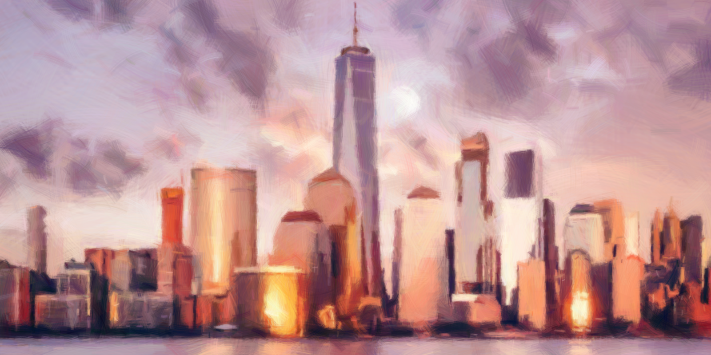
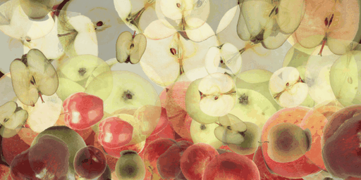
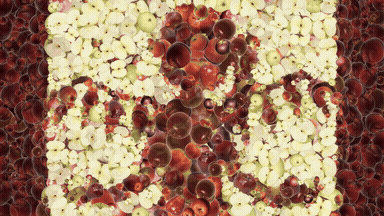

# GeneticPainting

Procedural painting in the spirit of [genetic-drawing](https://github.com/anopara/genetic-drawing):
a reference image is approximated by layering brush strokes, where each stroke
is found with a small genetic algorithm.



Textured stroke brushes above; the same pipeline with hard-edged blob
brushes gives a mosaic look instead
([output/final_blobs.png](output/final_blobs.png)).

## How it works

1. The canvas starts as the reference's mean color.
2. For each stroke, a population of random candidates (brush shape, position,
   size, rotation, opacity, color jitter) is evolved for a few generations.
   Fitness is the change in per-pixel error vs. the reference, evaluated only
   inside the stroke's bounding box.
3. Candidate positions are sampled from the current error map, so strokes are
   tried where the painting is still worst.
4. The winning stroke is alpha-composited onto the canvas if it improves the
   error. Stroke sizes anneal from coarse to fine, so early strokes block in
   large color regions and later strokes add detail.

Stroke colors are taken from the mean reference color under the brush
footprint, blended toward the color at the stroke center by an evolved
"center bias" gene (so small bright features like a moon or lit windows
aren't averaged away), plus an evolved jitter.

Fitness is edge-weighted (`--edge-weight`): per-pixel error is scaled up
near edges of the reference, because plain L1 error underweights small,
crisp features — a pale moon on pale clouds is numerically almost
invisible but perceptually obvious.

New strokes start roughly aligned with the local edge direction of the
reference (gradient-aligned initialization), so brushwork follows the
form; evolution is free to rotate away from it.

`--group N` evolves N strokes jointly per round (anopara-style DNA with
uniform crossover) instead of one at a time. At equal compute the greedy
default converges noticeably better; group mode is kept for
experimentation. Group fitness ignores stroke-stroke overlap, so each
stroke is re-checked exactly before committing — the canvas never gets
worse.

## Collage mode: paintings made of real things

`--keep-brush-color` pastes each brush's own pixels instead of recoloring
it from the reference — evolution then places brushes where their real
colors already match. With photos of real apples as brushes
(`examples/apples/`, cut out from Wikimedia Commons photos with GrabCut),
the skyline becomes the Big Apple made of apples:



```bash
python generate.py test.jpg --shapes examples/apples --keep-brush-color \
    --canvas black --strokes 7000 --max-dim 1000 --brush-max-dim 300 \
    --gif nyc_apples.gif
```

Start from `--canvas black` so every region needs paint (on a mean-color
canvas, flat regions are already "correct" and never get tiled).
`--gif` writes a timelapse of any run.

`examples/bad_apple.py` paints a whole video: the canvas persists across
frames, so the error map concentrates strokes exactly where the video
moved (temporal coherence), and each frame paints until improvement
plateaus — Bad Apple!!, but it's literally apples:



```bash
python examples/bad_apple.py bad_apple.mp4 --shapes examples/apples \
    --out bad_apple_painted.mp4
```

Brush photo credits: [examples/apples/SOURCES.md](examples/apples/SOURCES.md).

## How long does it take?

Runtime is roughly `strokes x population x generations x average stroke
area` — fitness is only evaluated inside each stroke's bounding box, so
canvas resolution matters through stroke size, not pixel count. Measured
examples (Apple-silicon laptop unless noted):

| render | settings | time |
|---|---|---|
| quick draft | 60 strokes, 400px | < 1 s |
| painterly skyline | 3,000 strokes, 1600px, pop 32 x gen 10 | ~2.5 min |
| refinement pass | 700–900 small strokes | < 1 min |
| apple collage | 10,000 strokes, 1600px | ~15 min |
| apple collage | 16,000 strokes, 2000px (16-core Linux box) | ~40 min |

Video painting is a different regime because the canvas persists across
frames: a static scene costs one 20-stroke batch while a scene cut
costs hundreds of strokes. Bad Apple!! (2,610 frames, 12 fps) renders
in roughly 10 min at 480px and under an hour at 1080p.

Knobs, in order of leverage: stroke count and `population x generations`
scale linearly (stills use 32x10, video 12x3); resolution scales roughly
quadratically since stroke sizes track the canvas.

Performance notes: candidate evaluation is patch-local and threaded
(cv2/numpy release the GIL); brushes are stored as mip pyramids so
stroke rasterization resizes from the nearest level instead of the full
brush (resizing was ~50% of runtime before); the weighted "old error"
comes straight from the maintained error map. Together these are ~4x
over the naive loop. A batched-MLX GPU scoring backend was tried and
measured slower end-to-end (padding waste + host-side batch assembly
outweigh the GPU math; rasterization stays CPU-bound in cv2), so the
portable numpy path is the only one shipped.

## Brushes

`generate.py` accepts any directory (or glob) of brush images via
`--shapes`: the alpha channel is used as a soft mask when present,
otherwise luminance (auto-inverted for bright backgrounds), so scanned
or hand-drawn brushes work as-is. `shapes.py` generates two built-in
styles: hard-edged blobs (`shapes/`) and textured fiber strokes
(`brushes/`, via `--style stroke`).

## Usage

```bash
pip install -r requirements.txt

# regenerate the built-in brushes (optional, already included)
python shapes.py                                        # hard-edged blobs -> shapes/
python shapes.py --style stroke --out brushes --seed 5  # textured strokes -> brushes/

# paint (defaults: test.jpg, 1500 strokes, blob brushes)
python generate.py test.jpg --strokes 3000 --max-dim 1600 --out output

# textured-brush painting (see output/final.png)
python generate.py test.jpg --shapes brushes --strokes 3500 --max-dim 1600 --out output

# optional: refine an existing result with small strokes and blob brushes only
python generate.py test.jpg --shapes 'shapes/[2346789].png' \
    --init-canvas output/final.png --strokes 700 --min-size 7 --max-size 70 \
    --max-dim 1600 --edge-weight 3 --out output
```

Progress snapshots are written to `output/progress_*.jpg` and the result to
`output/final.png`. See `python generate.py --help` for all options
(population size, GA generations, working resolution, starting canvas,
edge weighting, resume canvas, seed).
